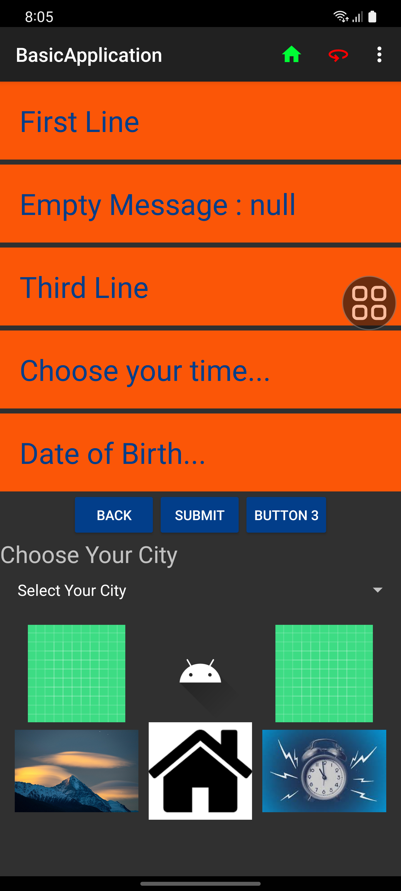
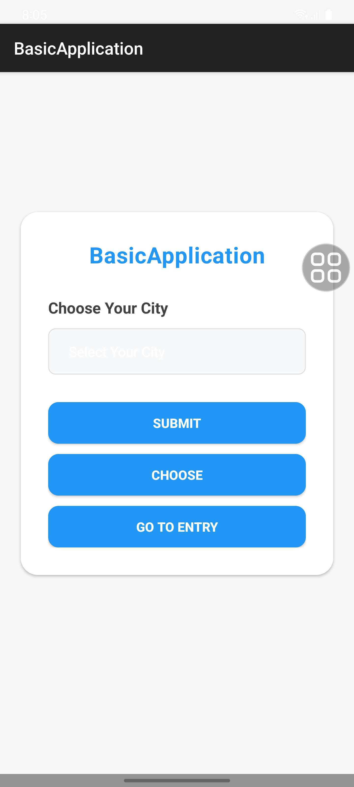
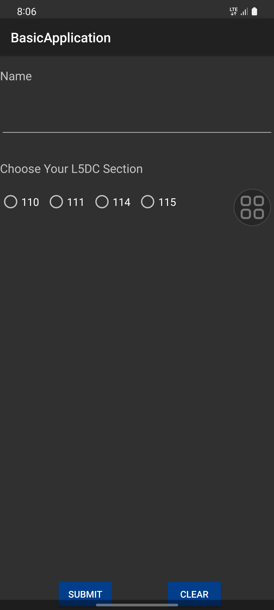

# BasicApplication 📱

A modern Android application built with Kotlin and Material Design for city selection, user registration, and data management.

## 🚀 Features
- **City Selection** - Beautiful dropdown for city selection
- **User Registration** - Complete form with name and section selection
- **Date of Birth Input** - Date picker functionality
- **Modern UI** - Material Design 3 components
- **Responsive Design** - Works on all screen sizes

## 📸 App Screenshots

| City Selection | User Registration | Date of Birth |
|:--------------:|:-----------------:|:-------------:|
|  |  |  |
| **Main Activity** Choose your city | **Form Activity** Enter user details | **Entry Activity** Select date of birth |

## 🏙️ City Selection Screen
- **Title**: Choose Your City
- **Dropdown**: Select from available cities
- **Buttons**: SUBMIT, CHOOSE, GO TO ENTRY
- **Functionality**: Validates city selection and provides feedback

## 👤 User Registration Screen
- **Name Input**: Text field for user name
- **L5DC Section**: Radio buttons for sections (110, 111, 114, 115)
- **Actions**: SUBMIT and CLEAR buttons
- **Validation**: Ensures all fields are filled

## 📅 Date of Birth Screen
- **Date Picker**: Select birth date
- **Navigation**: BACK, SUBMIT, and additional action buttons
- **Empty State**: Handles null message scenarios
- **Time Selection**: Choose your time functionality

## 🛠️ Technology Stack
- **Language**: Kotlin
- **UI**: Material Design 3, CardView, Spinner, DatePicker
- **Architecture**: MVC Pattern
- **Minimum SDK**: 24 (Android 7.0)
- **Target SDK**: 36 (Android 14)
